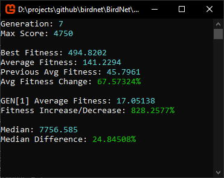

# BirdNet

Experimenting with neuroevolution and neural networks.
An AI learning to play Flappy Bird.

## Training Information


## Trained Bird Demo


## Training Birds Demo


## Cloning
If you are too clone this project, here is the simple commands.
```
git clone https://github.com/TxJson/bird-network [Location]
```

## Dependencies:
- [Monogame v3.7.1.189](http://community.monogame.net/t/monogame-3-7-1-release/11173)

## Licensing
[Apache License 2.0](https://github.com/TxJson/BirdNet/blob/master/LICENSE)
